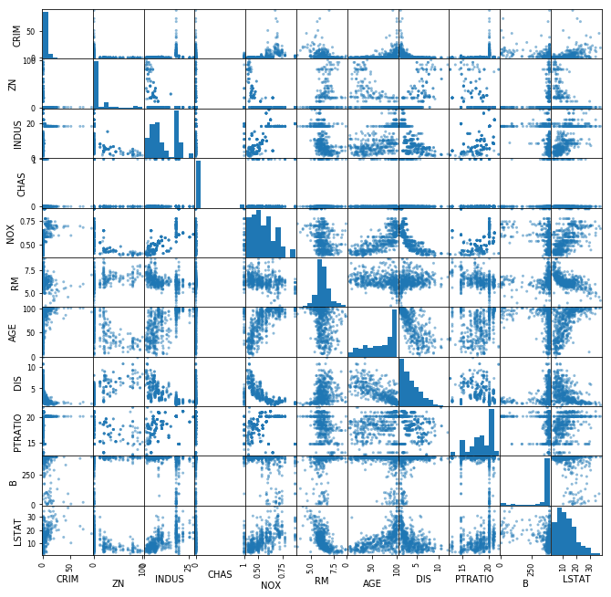

# Multicollinearity of Features - Lab

## Introduction

In this lab you'll identify multicollinearity in the Boston Housing Data set.

## Objectives
You will be able to:
* Plot heatmaps for the predictors of the Boston dataset
* Understand and calculate correlation matrices

## Correlation matrix for the Boston Housing data

Let's reimport the Boston Housing data and let's use the data with the categorical variables for `tax_dummy` and `rad_dummy`


```python
import pandas as pd
from sklearn.datasets import load_boston
boston = load_boston()

boston_features = pd.DataFrame(boston.data, columns = boston.feature_names)

# first, create bins for RAD based on the values observed. 5 values will result in 4 bins
bins = [0, 3, 4 , 5, 24]
bins_rad = pd.cut(boston_features['RAD'], bins)
bins_rad = bins_rad.cat.as_unordered()

# first, create bins for TAX based on the values observed. 6 values will result in 5 bins
bins = [0, 250, 300, 360, 460, 712]
bins_tax = pd.cut(boston_features['TAX'], bins)
bins_tax = bins_tax.cat.as_unordered()

tax_dummy = pd.get_dummies(bins_tax, prefix="TAX")
rad_dummy = pd.get_dummies(bins_rad, prefix="RAD")
boston_features = boston_features.drop(["RAD","TAX"], axis=1)
boston_features = pd.concat([boston_features, rad_dummy, tax_dummy], axis=1)
```


```python
boston_features.head()
```


```python
# __SOLUTION__ 
import pandas as pd
from sklearn.datasets import load_boston
boston = load_boston()

boston_features = pd.DataFrame(boston.data, columns = boston.feature_names)

# first, create bins for RAD based on the values observed. 5 values will result in 4 bins
bins = [0, 3, 4 , 5, 24]
bins_rad = pd.cut(boston_features['RAD'], bins)
bins_rad = bins_rad.cat.as_unordered()

# first, create bins for TAX based on the values observed. 6 values will result in 5 bins
bins = [0, 250, 300, 360, 460, 712]
bins_tax = pd.cut(boston_features['TAX'], bins)
bins_tax = bins_tax.cat.as_unordered()

tax_dummy = pd.get_dummies(bins_tax, prefix="TAX")
rad_dummy = pd.get_dummies(bins_rad, prefix="RAD")
boston_features = boston_features.drop(["RAD","TAX"], axis=1)
boston_features = pd.concat([boston_features, rad_dummy, tax_dummy], axis=1)
```


```python
# __SOLUTION__ 
boston_features.head()
```


<div>
<style scoped>
    .dataframe tbody tr th:only-of-type {
        vertical-align: middle;
    }

    .dataframe tbody tr th {
        vertical-align: top;
    }

    .dataframe thead th {
        text-align: right;
    }
</style>
<table border="1" class="dataframe">
  <thead>
    <tr style="text-align: right;">
      <th></th>
      <th>CRIM</th>
      <th>ZN</th>
      <th>INDUS</th>
      <th>CHAS</th>
      <th>NOX</th>
      <th>RM</th>
      <th>AGE</th>
      <th>DIS</th>
      <th>PTRATIO</th>
      <th>B</th>
      <th>LSTAT</th>
      <th>RAD_(0, 3]</th>
      <th>RAD_(3, 4]</th>
      <th>RAD_(4, 5]</th>
      <th>RAD_(5, 24]</th>
      <th>TAX_(0, 250]</th>
      <th>TAX_(250, 300]</th>
      <th>TAX_(300, 360]</th>
      <th>TAX_(360, 460]</th>
      <th>TAX_(460, 712]</th>
    </tr>
  </thead>
  <tbody>
    <tr>
      <th>0</th>
      <td>0.00632</td>
      <td>18.0</td>
      <td>2.31</td>
      <td>0.0</td>
      <td>0.538</td>
      <td>6.575</td>
      <td>65.2</td>
      <td>4.0900</td>
      <td>15.3</td>
      <td>396.90</td>
      <td>4.98</td>
      <td>1</td>
      <td>0</td>
      <td>0</td>
      <td>0</td>
      <td>0</td>
      <td>1</td>
      <td>0</td>
      <td>0</td>
      <td>0</td>
    </tr>
    <tr>
      <th>1</th>
      <td>0.02731</td>
      <td>0.0</td>
      <td>7.07</td>
      <td>0.0</td>
      <td>0.469</td>
      <td>6.421</td>
      <td>78.9</td>
      <td>4.9671</td>
      <td>17.8</td>
      <td>396.90</td>
      <td>9.14</td>
      <td>1</td>
      <td>0</td>
      <td>0</td>
      <td>0</td>
      <td>1</td>
      <td>0</td>
      <td>0</td>
      <td>0</td>
      <td>0</td>
    </tr>
    <tr>
      <th>2</th>
      <td>0.02729</td>
      <td>0.0</td>
      <td>7.07</td>
      <td>0.0</td>
      <td>0.469</td>
      <td>7.185</td>
      <td>61.1</td>
      <td>4.9671</td>
      <td>17.8</td>
      <td>392.83</td>
      <td>4.03</td>
      <td>1</td>
      <td>0</td>
      <td>0</td>
      <td>0</td>
      <td>1</td>
      <td>0</td>
      <td>0</td>
      <td>0</td>
      <td>0</td>
    </tr>
    <tr>
      <th>3</th>
      <td>0.03237</td>
      <td>0.0</td>
      <td>2.18</td>
      <td>0.0</td>
      <td>0.458</td>
      <td>6.998</td>
      <td>45.8</td>
      <td>6.0622</td>
      <td>18.7</td>
      <td>394.63</td>
      <td>2.94</td>
      <td>1</td>
      <td>0</td>
      <td>0</td>
      <td>0</td>
      <td>1</td>
      <td>0</td>
      <td>0</td>
      <td>0</td>
      <td>0</td>
    </tr>
    <tr>
      <th>4</th>
      <td>0.06905</td>
      <td>0.0</td>
      <td>2.18</td>
      <td>0.0</td>
      <td>0.458</td>
      <td>7.147</td>
      <td>54.2</td>
      <td>6.0622</td>
      <td>18.7</td>
      <td>396.90</td>
      <td>5.33</td>
      <td>1</td>
      <td>0</td>
      <td>0</td>
      <td>0</td>
      <td>1</td>
      <td>0</td>
      <td>0</td>
      <td>0</td>
      <td>0</td>
    </tr>
  </tbody>
</table>
</div>


## Scatter matrix

Create the scatter matrix for the Boston Housing data.


```python

```


```python
# __SOLUTION__ 
pd.plotting.scatter_matrix(boston_features,figsize  = [10, 10]);
```





This took a while to load. Not surprisingly, the categorical variables didn't really provide any meaningful result. remove the categorical columns associated with "RAD" and "TAX" from the data again and look at the scatter matrix again.


```python

```


```python

```


```python
# __SOLUTION__ 
boston_cont = boston_features.iloc[:,0:11]
```


```python
# __SOLUTION__ 
pd.plotting.scatter_matrix(boston_cont,figsize  = [11, 11]);
```


## Correlation matrix

Next, let's look at the correlation matrix


```python

```


```python
# __SOLUTION__ 
boston_cont.corr()
```


<div>
<style scoped>
    .dataframe tbody tr th:only-of-type {
        vertical-align: middle;
    }

    .dataframe tbody tr th {
        vertical-align: top;
    }

    .dataframe thead th {
        text-align: right;
    }
</style>
<table border="1" class="dataframe">
  <thead>
    <tr style="text-align: right;">
      <th></th>
      <th>CRIM</th>
      <th>ZN</th>
      <th>INDUS</th>
      <th>CHAS</th>
      <th>NOX</th>
      <th>RM</th>
      <th>AGE</th>
      <th>DIS</th>
      <th>PTRATIO</th>
      <th>B</th>
      <th>LSTAT</th>
    </tr>
  </thead>
  <tbody>
    <tr>
      <th>CRIM</th>
      <td>1.000000</td>
      <td>-0.199458</td>
      <td>0.404471</td>
      <td>-0.055295</td>
      <td>0.417521</td>
      <td>-0.219940</td>
      <td>0.350784</td>
      <td>-0.377904</td>
      <td>0.288250</td>
      <td>-0.377365</td>
      <td>0.452220</td>
    </tr>
    <tr>
      <th>ZN</th>
      <td>-0.199458</td>
      <td>1.000000</td>
      <td>-0.533828</td>
      <td>-0.042697</td>
      <td>-0.516604</td>
      <td>0.311991</td>
      <td>-0.569537</td>
      <td>0.664408</td>
      <td>-0.391679</td>
      <td>0.175520</td>
      <td>-0.412995</td>
    </tr>
    <tr>
      <th>INDUS</th>
      <td>0.404471</td>
      <td>-0.533828</td>
      <td>1.000000</td>
      <td>0.062938</td>
      <td>0.763651</td>
      <td>-0.391676</td>
      <td>0.644779</td>
      <td>-0.708027</td>
      <td>0.383248</td>
      <td>-0.356977</td>
      <td>0.603800</td>
    </tr>
    <tr>
      <th>CHAS</th>
      <td>-0.055295</td>
      <td>-0.042697</td>
      <td>0.062938</td>
      <td>1.000000</td>
      <td>0.091203</td>
      <td>0.091251</td>
      <td>0.086518</td>
      <td>-0.099176</td>
      <td>-0.121515</td>
      <td>0.048788</td>
      <td>-0.053929</td>
    </tr>
    <tr>
      <th>NOX</th>
      <td>0.417521</td>
      <td>-0.516604</td>
      <td>0.763651</td>
      <td>0.091203</td>
      <td>1.000000</td>
      <td>-0.302188</td>
      <td>0.731470</td>
      <td>-0.769230</td>
      <td>0.188933</td>
      <td>-0.380051</td>
      <td>0.590879</td>
    </tr>
    <tr>
      <th>RM</th>
      <td>-0.219940</td>
      <td>0.311991</td>
      <td>-0.391676</td>
      <td>0.091251</td>
      <td>-0.302188</td>
      <td>1.000000</td>
      <td>-0.240265</td>
      <td>0.205246</td>
      <td>-0.355501</td>
      <td>0.128069</td>
      <td>-0.613808</td>
    </tr>
    <tr>
      <th>AGE</th>
      <td>0.350784</td>
      <td>-0.569537</td>
      <td>0.644779</td>
      <td>0.086518</td>
      <td>0.731470</td>
      <td>-0.240265</td>
      <td>1.000000</td>
      <td>-0.747881</td>
      <td>0.261515</td>
      <td>-0.273534</td>
      <td>0.602339</td>
    </tr>
    <tr>
      <th>DIS</th>
      <td>-0.377904</td>
      <td>0.664408</td>
      <td>-0.708027</td>
      <td>-0.099176</td>
      <td>-0.769230</td>
      <td>0.205246</td>
      <td>-0.747881</td>
      <td>1.000000</td>
      <td>-0.232471</td>
      <td>0.291512</td>
      <td>-0.496996</td>
    </tr>
    <tr>
      <th>PTRATIO</th>
      <td>0.288250</td>
      <td>-0.391679</td>
      <td>0.383248</td>
      <td>-0.121515</td>
      <td>0.188933</td>
      <td>-0.355501</td>
      <td>0.261515</td>
      <td>-0.232471</td>
      <td>1.000000</td>
      <td>-0.177383</td>
      <td>0.374044</td>
    </tr>
    <tr>
      <th>B</th>
      <td>-0.377365</td>
      <td>0.175520</td>
      <td>-0.356977</td>
      <td>0.048788</td>
      <td>-0.380051</td>
      <td>0.128069</td>
      <td>-0.273534</td>
      <td>0.291512</td>
      <td>-0.177383</td>
      <td>1.000000</td>
      <td>-0.366087</td>
    </tr>
    <tr>
      <th>LSTAT</th>
      <td>0.452220</td>
      <td>-0.412995</td>
      <td>0.603800</td>
      <td>-0.053929</td>
      <td>0.590879</td>
      <td>-0.613808</td>
      <td>0.602339</td>
      <td>-0.496996</td>
      <td>0.374044</td>
      <td>-0.366087</td>
      <td>1.000000</td>
    </tr>
  </tbody>
</table>
</div>


Return "True" for positive or negative correlations that are bigger than 0.75.


```python

```


```python
# __SOLUTION__ 
abs(boston_cont.corr())>0.75
```


<div>
<style scoped>
    .dataframe tbody tr th:only-of-type {
        vertical-align: middle;
    }

    .dataframe tbody tr th {
        vertical-align: top;
    }

    .dataframe thead th {
        text-align: right;
    }
</style>
<table border="1" class="dataframe">
  <thead>
    <tr style="text-align: right;">
      <th></th>
      <th>CRIM</th>
      <th>ZN</th>
      <th>INDUS</th>
      <th>CHAS</th>
      <th>NOX</th>
      <th>RM</th>
      <th>AGE</th>
      <th>DIS</th>
      <th>PTRATIO</th>
      <th>B</th>
      <th>LSTAT</th>
    </tr>
  </thead>
  <tbody>
    <tr>
      <th>CRIM</th>
      <td>True</td>
      <td>False</td>
      <td>False</td>
      <td>False</td>
      <td>False</td>
      <td>False</td>
      <td>False</td>
      <td>False</td>
      <td>False</td>
      <td>False</td>
      <td>False</td>
    </tr>
    <tr>
      <th>ZN</th>
      <td>False</td>
      <td>True</td>
      <td>False</td>
      <td>False</td>
      <td>False</td>
      <td>False</td>
      <td>False</td>
      <td>False</td>
      <td>False</td>
      <td>False</td>
      <td>False</td>
    </tr>
    <tr>
      <th>INDUS</th>
      <td>False</td>
      <td>False</td>
      <td>True</td>
      <td>False</td>
      <td>True</td>
      <td>False</td>
      <td>False</td>
      <td>False</td>
      <td>False</td>
      <td>False</td>
      <td>False</td>
    </tr>
    <tr>
      <th>CHAS</th>
      <td>False</td>
      <td>False</td>
      <td>False</td>
      <td>True</td>
      <td>False</td>
      <td>False</td>
      <td>False</td>
      <td>False</td>
      <td>False</td>
      <td>False</td>
      <td>False</td>
    </tr>
    <tr>
      <th>NOX</th>
      <td>False</td>
      <td>False</td>
      <td>True</td>
      <td>False</td>
      <td>True</td>
      <td>False</td>
      <td>False</td>
      <td>True</td>
      <td>False</td>
      <td>False</td>
      <td>False</td>
    </tr>
    <tr>
      <th>RM</th>
      <td>False</td>
      <td>False</td>
      <td>False</td>
      <td>False</td>
      <td>False</td>
      <td>True</td>
      <td>False</td>
      <td>False</td>
      <td>False</td>
      <td>False</td>
      <td>False</td>
    </tr>
    <tr>
      <th>AGE</th>
      <td>False</td>
      <td>False</td>
      <td>False</td>
      <td>False</td>
      <td>False</td>
      <td>False</td>
      <td>True</td>
      <td>False</td>
      <td>False</td>
      <td>False</td>
      <td>False</td>
    </tr>
    <tr>
      <th>DIS</th>
      <td>False</td>
      <td>False</td>
      <td>False</td>
      <td>False</td>
      <td>True</td>
      <td>False</td>
      <td>False</td>
      <td>True</td>
      <td>False</td>
      <td>False</td>
      <td>False</td>
    </tr>
    <tr>
      <th>PTRATIO</th>
      <td>False</td>
      <td>False</td>
      <td>False</td>
      <td>False</td>
      <td>False</td>
      <td>False</td>
      <td>False</td>
      <td>False</td>
      <td>True</td>
      <td>False</td>
      <td>False</td>
    </tr>
    <tr>
      <th>B</th>
      <td>False</td>
      <td>False</td>
      <td>False</td>
      <td>False</td>
      <td>False</td>
      <td>False</td>
      <td>False</td>
      <td>False</td>
      <td>False</td>
      <td>True</td>
      <td>False</td>
    </tr>
    <tr>
      <th>LSTAT</th>
      <td>False</td>
      <td>False</td>
      <td>False</td>
      <td>False</td>
      <td>False</td>
      <td>False</td>
      <td>False</td>
      <td>False</td>
      <td>False</td>
      <td>False</td>
      <td>True</td>
    </tr>
  </tbody>
</table>
</div>


Remove the most problematic feature from the data.


```python

```


```python
# __SOLUTION__ 
boston_features = boston_features.drop("NOX",axis=1)
```

## Summary
Good job! You've now edited the Boston Housing Data so highly correlated variables are removed. 
