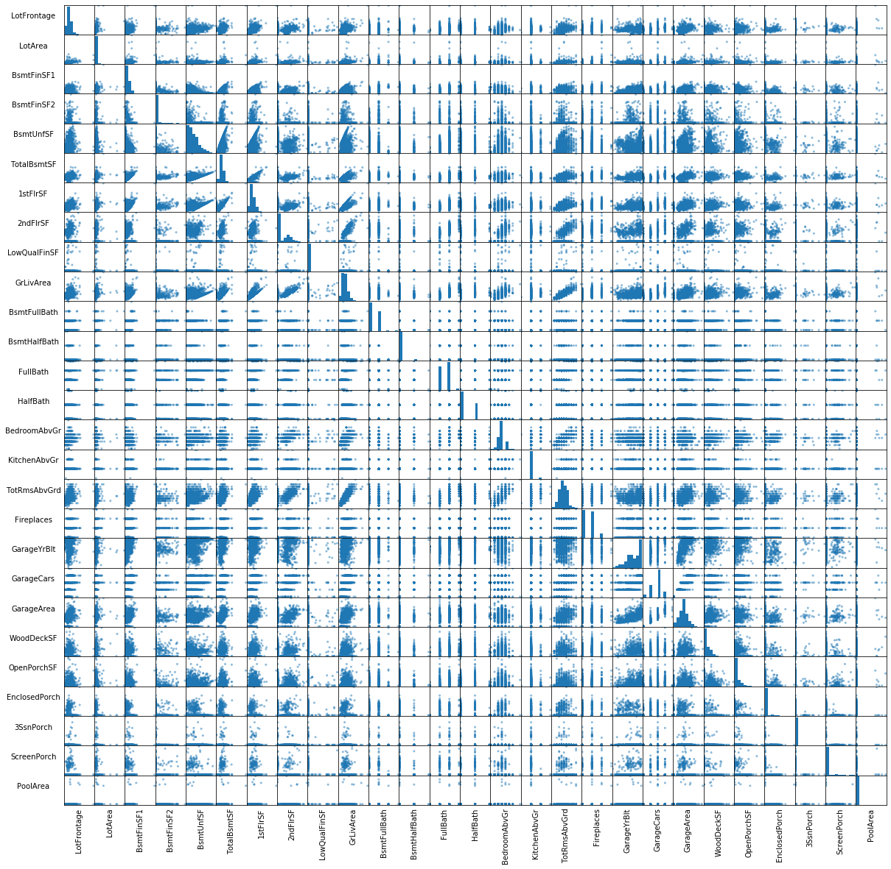

# Multicollinearity of Features - Lab

## Introduction

In this lab, you'll identify multicollinearity in the Ames Housing dataset.

## Objectives
You will be able to:
* Create a scatter matrix and correlation matrix
* Assess Intpret the output of a correlation matrix
* Identify if variables are exhibiting collinearity
* Decide how to address the collinearity in the data set

## Correlation matrix for the Ames Housing data

### Import data

Let's reimport the Ames Housing data assign the numeric variables we want to keep to `numeric_vars`.


```python
import pandas as pd
import numpy as np
import matplotlib.pyplot as plt
%matplotlib inline

pd.options.display.max_columns = 999
pd.options.display.max_rows = 999

ames = pd.read_csv('ames.csv')

numeric_vars = ['LotFrontage', 'LotArea', 'BsmtFinSF1', 'BsmtFinSF2', 'BsmtUnfSF',
                'TotalBsmtSF', '1stFlrSF', '2ndFlrSF','LowQualFinSF', 'GrLivArea',
                'BsmtFullBath', 'BsmtHalfBath', 'FullBath', 'HalfBath', 'BedroomAbvGr',
                'KitchenAbvGr', 'TotRmsAbvGrd', 'Fireplaces', 'GarageYrBlt', 'GarageCars',
                'GarageArea', 'WoodDeckSF', 'OpenPorchSF', 'EnclosedPorch', '3SsnPorch',
                'ScreenPorch', 'PoolArea']
```


```python
# __SOLUTION__ 
import pandas as pd
import numpy as np
import matplotlib.pyplot as plt
%matplotlib inline

pd.options.display.max_columns = 999

ames = pd.read_csv('ames.csv')

numeric_vars = ['LotFrontage', 'LotArea', 'BsmtFinSF1', 'BsmtFinSF2', 'BsmtUnfSF',
                'TotalBsmtSF', '1stFlrSF', '2ndFlrSF','LowQualFinSF', 'GrLivArea',
                'BsmtFullBath', 'BsmtHalfBath', 'FullBath', 'HalfBath', 'BedroomAbvGr',
                'KitchenAbvGr', 'TotRmsAbvGrd', 'Fireplaces', 'GarageYrBlt', 'GarageCars',
                'GarageArea', 'WoodDeckSF', 'OpenPorchSF', 'EnclosedPorch', '3SsnPorch',
                'ScreenPorch', 'PoolArea']
```

### Create processed
Create a new dataframe named `ames_preprocessed` that contains only the features in `numeric_vars`.


```python
# create single dataframe called ames_preprocessed
```


```python
# __SOLUTION__

ames_preprocessed = ames.loc[:,numeric_vars]
ames_preprocessed.head()
```


<div>
<style scoped>
    .dataframe tbody tr th:only-of-type {
        vertical-align: middle;
    }

    .dataframe tbody tr th {
        vertical-align: top;
    }

    .dataframe thead th {
        text-align: right;
    }
</style>
<table border="1" class="dataframe">
  <thead>
    <tr style="text-align: right;">
      <th></th>
      <th>LotFrontage</th>
      <th>LotArea</th>
      <th>BsmtFinSF1</th>
      <th>BsmtFinSF2</th>
      <th>BsmtUnfSF</th>
      <th>TotalBsmtSF</th>
      <th>1stFlrSF</th>
      <th>2ndFlrSF</th>
      <th>LowQualFinSF</th>
      <th>GrLivArea</th>
      <th>BsmtFullBath</th>
      <th>BsmtHalfBath</th>
      <th>FullBath</th>
      <th>HalfBath</th>
      <th>BedroomAbvGr</th>
      <th>KitchenAbvGr</th>
      <th>TotRmsAbvGrd</th>
      <th>Fireplaces</th>
      <th>GarageYrBlt</th>
      <th>GarageCars</th>
      <th>GarageArea</th>
      <th>WoodDeckSF</th>
      <th>OpenPorchSF</th>
      <th>EnclosedPorch</th>
      <th>3SsnPorch</th>
      <th>ScreenPorch</th>
      <th>PoolArea</th>
    </tr>
  </thead>
  <tbody>
    <tr>
      <th>0</th>
      <td>65.0</td>
      <td>8450</td>
      <td>706</td>
      <td>0</td>
      <td>150</td>
      <td>856</td>
      <td>856</td>
      <td>854</td>
      <td>0</td>
      <td>1710</td>
      <td>1</td>
      <td>0</td>
      <td>2</td>
      <td>1</td>
      <td>3</td>
      <td>1</td>
      <td>8</td>
      <td>0</td>
      <td>2003.0</td>
      <td>2</td>
      <td>548</td>
      <td>0</td>
      <td>61</td>
      <td>0</td>
      <td>0</td>
      <td>0</td>
      <td>0</td>
    </tr>
    <tr>
      <th>1</th>
      <td>80.0</td>
      <td>9600</td>
      <td>978</td>
      <td>0</td>
      <td>284</td>
      <td>1262</td>
      <td>1262</td>
      <td>0</td>
      <td>0</td>
      <td>1262</td>
      <td>0</td>
      <td>1</td>
      <td>2</td>
      <td>0</td>
      <td>3</td>
      <td>1</td>
      <td>6</td>
      <td>1</td>
      <td>1976.0</td>
      <td>2</td>
      <td>460</td>
      <td>298</td>
      <td>0</td>
      <td>0</td>
      <td>0</td>
      <td>0</td>
      <td>0</td>
    </tr>
    <tr>
      <th>2</th>
      <td>68.0</td>
      <td>11250</td>
      <td>486</td>
      <td>0</td>
      <td>434</td>
      <td>920</td>
      <td>920</td>
      <td>866</td>
      <td>0</td>
      <td>1786</td>
      <td>1</td>
      <td>0</td>
      <td>2</td>
      <td>1</td>
      <td>3</td>
      <td>1</td>
      <td>6</td>
      <td>1</td>
      <td>2001.0</td>
      <td>2</td>
      <td>608</td>
      <td>0</td>
      <td>42</td>
      <td>0</td>
      <td>0</td>
      <td>0</td>
      <td>0</td>
    </tr>
    <tr>
      <th>3</th>
      <td>60.0</td>
      <td>9550</td>
      <td>216</td>
      <td>0</td>
      <td>540</td>
      <td>756</td>
      <td>961</td>
      <td>756</td>
      <td>0</td>
      <td>1717</td>
      <td>1</td>
      <td>0</td>
      <td>1</td>
      <td>0</td>
      <td>3</td>
      <td>1</td>
      <td>7</td>
      <td>1</td>
      <td>1998.0</td>
      <td>3</td>
      <td>642</td>
      <td>0</td>
      <td>35</td>
      <td>272</td>
      <td>0</td>
      <td>0</td>
      <td>0</td>
    </tr>
    <tr>
      <th>4</th>
      <td>84.0</td>
      <td>14260</td>
      <td>655</td>
      <td>0</td>
      <td>490</td>
      <td>1145</td>
      <td>1145</td>
      <td>1053</td>
      <td>0</td>
      <td>2198</td>
      <td>1</td>
      <td>0</td>
      <td>2</td>
      <td>1</td>
      <td>4</td>
      <td>1</td>
      <td>9</td>
      <td>1</td>
      <td>2000.0</td>
      <td>3</td>
      <td>836</td>
      <td>192</td>
      <td>84</td>
      <td>0</td>
      <td>0</td>
      <td>0</td>
      <td>0</td>
    </tr>
  </tbody>
</table>
</div>


## Scatter matrix
Create the scatter matrix for the Ames Housing data. This takes a few minutes to load!


```python
# use pd.plotting.scatter_matrix
```


```python
# __SOLUTION__ 
pd.plotting.scatter_matrix(ames_preprocessed, figsize=[12, 12]);
```


The scatter matrix took a while to load and is hard to read. Run the code below to see if adjusting some of the visualization settings helps. 


```python
sm = pd.plotting.scatter_matrix(ames_preprocessed, figsize=[20, 20]);

# Rotates the text
[s.xaxis.label.set_rotation(90) for s in sm.reshape(-1)]
[s.yaxis.label.set_rotation(0) for s in sm.reshape(-1)]

#May need to offset label when rotating to prevent overlap of figure
[s.get_yaxis().set_label_coords(-1,0.5) for s in sm.reshape(-1)]

#Hide all ticks
[s.set_xticks(()) for s in sm.reshape(-1)]
[s.set_yticks(()) for s in sm.reshape(-1)]

plt.show()
```


```python
#__Solution__
sm = pd.plotting.scatter_matrix(ames_preprocessed, figsize=[20, 20]);

# Rotates the text
[s.xaxis.label.set_rotation(90) for s in sm.reshape(-1)]
[s.yaxis.label.set_rotation(0) for s in sm.reshape(-1)]

#May need to offset label when rotating to prevent overlap of figure
[s.get_yaxis().set_label_coords(-1,0.5) for s in sm.reshape(-1)]

#Hide all ticks
[s.set_xticks(()) for s in sm.reshape(-1)]
[s.set_yticks(()) for s in sm.reshape(-1)]

plt.show()
```





The enhanced plot demonstrates that with larger datasets, scatter matricies become less useful. Through careful examination of the matrix it's clear that `TotRmsAbvGrd` seems correlated with `GrLivArea`, but how easy to use would this matrix if a dataset has hundreds or thousands of variables? Also visual approach to finding correlation cannot be automated, so a numeric approach is a good next step.

## Correlation matrix

Next, create and look at the correlation matrix: 


```python

```


```python
# __SOLUTION__ 
ames_preprocessed.corr()
```


<div>
<style scoped>
    .dataframe tbody tr th:only-of-type {
        vertical-align: middle;
    }

    .dataframe tbody tr th {
        vertical-align: top;
    }

    .dataframe thead th {
        text-align: right;
    }
</style>
<table border="1" class="dataframe">
  <thead>
    <tr style="text-align: right;">
      <th></th>
      <th>LotFrontage</th>
      <th>LotArea</th>
      <th>BsmtFinSF1</th>
      <th>BsmtFinSF2</th>
      <th>BsmtUnfSF</th>
      <th>TotalBsmtSF</th>
      <th>1stFlrSF</th>
      <th>2ndFlrSF</th>
      <th>LowQualFinSF</th>
      <th>GrLivArea</th>
      <th>BsmtFullBath</th>
      <th>BsmtHalfBath</th>
      <th>FullBath</th>
      <th>HalfBath</th>
      <th>BedroomAbvGr</th>
      <th>KitchenAbvGr</th>
      <th>TotRmsAbvGrd</th>
      <th>Fireplaces</th>
      <th>GarageYrBlt</th>
      <th>GarageCars</th>
      <th>GarageArea</th>
      <th>WoodDeckSF</th>
      <th>OpenPorchSF</th>
      <th>EnclosedPorch</th>
      <th>3SsnPorch</th>
      <th>ScreenPorch</th>
      <th>PoolArea</th>
    </tr>
  </thead>
  <tbody>
    <tr>
      <th>LotFrontage</th>
      <td>1.000000</td>
      <td>0.426095</td>
      <td>0.233633</td>
      <td>0.049900</td>
      <td>0.132644</td>
      <td>0.392075</td>
      <td>0.457181</td>
      <td>0.080177</td>
      <td>0.038469</td>
      <td>0.402797</td>
      <td>0.100949</td>
      <td>-0.007234</td>
      <td>0.198769</td>
      <td>0.053532</td>
      <td>0.263170</td>
      <td>-0.006069</td>
      <td>0.352096</td>
      <td>0.266639</td>
      <td>0.070250</td>
      <td>0.285691</td>
      <td>0.344997</td>
      <td>0.088521</td>
      <td>0.151972</td>
      <td>0.010700</td>
      <td>0.070029</td>
      <td>0.041383</td>
      <td>0.206167</td>
    </tr>
    <tr>
      <th>LotArea</th>
      <td>0.426095</td>
      <td>1.000000</td>
      <td>0.214103</td>
      <td>0.111170</td>
      <td>-0.002618</td>
      <td>0.260833</td>
      <td>0.299475</td>
      <td>0.050986</td>
      <td>0.004779</td>
      <td>0.263116</td>
      <td>0.158155</td>
      <td>0.048046</td>
      <td>0.126031</td>
      <td>0.014259</td>
      <td>0.119690</td>
      <td>-0.017784</td>
      <td>0.190015</td>
      <td>0.271364</td>
      <td>-0.024947</td>
      <td>0.154871</td>
      <td>0.180403</td>
      <td>0.171698</td>
      <td>0.084774</td>
      <td>-0.018340</td>
      <td>0.020423</td>
      <td>0.043160</td>
      <td>0.077672</td>
    </tr>
    <tr>
      <th>BsmtFinSF1</th>
      <td>0.233633</td>
      <td>0.214103</td>
      <td>1.000000</td>
      <td>-0.050117</td>
      <td>-0.495251</td>
      <td>0.522396</td>
      <td>0.445863</td>
      <td>-0.137079</td>
      <td>-0.064503</td>
      <td>0.208171</td>
      <td>0.649212</td>
      <td>0.067418</td>
      <td>0.058543</td>
      <td>0.004262</td>
      <td>-0.107355</td>
      <td>-0.081007</td>
      <td>0.044316</td>
      <td>0.260011</td>
      <td>0.153484</td>
      <td>0.224054</td>
      <td>0.296970</td>
      <td>0.204306</td>
      <td>0.111761</td>
      <td>-0.102303</td>
      <td>0.026451</td>
      <td>0.062021</td>
      <td>0.140491</td>
    </tr>
    <tr>
      <th>BsmtFinSF2</th>
      <td>0.049900</td>
      <td>0.111170</td>
      <td>-0.050117</td>
      <td>1.000000</td>
      <td>-0.209294</td>
      <td>0.104810</td>
      <td>0.097117</td>
      <td>-0.099260</td>
      <td>0.014807</td>
      <td>-0.009640</td>
      <td>0.158678</td>
      <td>0.070948</td>
      <td>-0.076444</td>
      <td>-0.032148</td>
      <td>-0.015728</td>
      <td>-0.040751</td>
      <td>-0.035227</td>
      <td>0.046921</td>
      <td>-0.088011</td>
      <td>-0.038264</td>
      <td>-0.018227</td>
      <td>0.067898</td>
      <td>0.003093</td>
      <td>0.036543</td>
      <td>-0.029993</td>
      <td>0.088871</td>
      <td>0.041709</td>
    </tr>
    <tr>
      <th>BsmtUnfSF</th>
      <td>0.132644</td>
      <td>-0.002618</td>
      <td>-0.495251</td>
      <td>-0.209294</td>
      <td>1.000000</td>
      <td>0.415360</td>
      <td>0.317987</td>
      <td>0.004469</td>
      <td>0.028167</td>
      <td>0.240257</td>
      <td>-0.422900</td>
      <td>-0.095804</td>
      <td>0.288886</td>
      <td>-0.041118</td>
      <td>0.166643</td>
      <td>0.030086</td>
      <td>0.250647</td>
      <td>0.051575</td>
      <td>0.190708</td>
      <td>0.214175</td>
      <td>0.183303</td>
      <td>-0.005316</td>
      <td>0.129005</td>
      <td>-0.002538</td>
      <td>0.020764</td>
      <td>-0.012579</td>
      <td>-0.035092</td>
    </tr>
    <tr>
      <th>TotalBsmtSF</th>
      <td>0.392075</td>
      <td>0.260833</td>
      <td>0.522396</td>
      <td>0.104810</td>
      <td>0.415360</td>
      <td>1.000000</td>
      <td>0.819530</td>
      <td>-0.174512</td>
      <td>-0.033245</td>
      <td>0.454868</td>
      <td>0.307351</td>
      <td>-0.000315</td>
      <td>0.323722</td>
      <td>-0.048804</td>
      <td>0.050450</td>
      <td>-0.068901</td>
      <td>0.285573</td>
      <td>0.339519</td>
      <td>0.322445</td>
      <td>0.434585</td>
      <td>0.486665</td>
      <td>0.232019</td>
      <td>0.247264</td>
      <td>-0.095478</td>
      <td>0.037384</td>
      <td>0.084489</td>
      <td>0.126053</td>
    </tr>
    <tr>
      <th>1stFlrSF</th>
      <td>0.457181</td>
      <td>0.299475</td>
      <td>0.445863</td>
      <td>0.097117</td>
      <td>0.317987</td>
      <td>0.819530</td>
      <td>1.000000</td>
      <td>-0.202646</td>
      <td>-0.014241</td>
      <td>0.566024</td>
      <td>0.244671</td>
      <td>0.001956</td>
      <td>0.380637</td>
      <td>-0.119916</td>
      <td>0.127401</td>
      <td>0.068101</td>
      <td>0.409516</td>
      <td>0.410531</td>
      <td>0.233449</td>
      <td>0.439317</td>
      <td>0.489782</td>
      <td>0.235459</td>
      <td>0.211671</td>
      <td>-0.065292</td>
      <td>0.056104</td>
      <td>0.088758</td>
      <td>0.131525</td>
    </tr>
    <tr>
      <th>2ndFlrSF</th>
      <td>0.080177</td>
      <td>0.050986</td>
      <td>-0.137079</td>
      <td>-0.099260</td>
      <td>0.004469</td>
      <td>-0.174512</td>
      <td>-0.202646</td>
      <td>1.000000</td>
      <td>0.063353</td>
      <td>0.687501</td>
      <td>-0.169494</td>
      <td>-0.023855</td>
      <td>0.421378</td>
      <td>0.609707</td>
      <td>0.502901</td>
      <td>0.059306</td>
      <td>0.616423</td>
      <td>0.194561</td>
      <td>0.070832</td>
      <td>0.183926</td>
      <td>0.138347</td>
      <td>0.092165</td>
      <td>0.208026</td>
      <td>0.061989</td>
      <td>-0.024358</td>
      <td>0.040606</td>
      <td>0.081487</td>
    </tr>
    <tr>
      <th>LowQualFinSF</th>
      <td>0.038469</td>
      <td>0.004779</td>
      <td>-0.064503</td>
      <td>0.014807</td>
      <td>0.028167</td>
      <td>-0.033245</td>
      <td>-0.014241</td>
      <td>0.063353</td>
      <td>1.000000</td>
      <td>0.134683</td>
      <td>-0.047143</td>
      <td>-0.005842</td>
      <td>-0.000710</td>
      <td>-0.027080</td>
      <td>0.105607</td>
      <td>0.007522</td>
      <td>0.131185</td>
      <td>-0.021272</td>
      <td>-0.036363</td>
      <td>-0.094480</td>
      <td>-0.067601</td>
      <td>-0.025444</td>
      <td>0.018251</td>
      <td>0.061081</td>
      <td>-0.004296</td>
      <td>0.026799</td>
      <td>0.062157</td>
    </tr>
    <tr>
      <th>GrLivArea</th>
      <td>0.402797</td>
      <td>0.263116</td>
      <td>0.208171</td>
      <td>-0.009640</td>
      <td>0.240257</td>
      <td>0.454868</td>
      <td>0.566024</td>
      <td>0.687501</td>
      <td>0.134683</td>
      <td>1.000000</td>
      <td>0.034836</td>
      <td>-0.018918</td>
      <td>0.630012</td>
      <td>0.415772</td>
      <td>0.521270</td>
      <td>0.100063</td>
      <td>0.825489</td>
      <td>0.461679</td>
      <td>0.231197</td>
      <td>0.467247</td>
      <td>0.468997</td>
      <td>0.247433</td>
      <td>0.330224</td>
      <td>0.009113</td>
      <td>0.020643</td>
      <td>0.101510</td>
      <td>0.170205</td>
    </tr>
    <tr>
      <th>BsmtFullBath</th>
      <td>0.100949</td>
      <td>0.158155</td>
      <td>0.649212</td>
      <td>0.158678</td>
      <td>-0.422900</td>
      <td>0.307351</td>
      <td>0.244671</td>
      <td>-0.169494</td>
      <td>-0.047143</td>
      <td>0.034836</td>
      <td>1.000000</td>
      <td>-0.147871</td>
      <td>-0.064512</td>
      <td>-0.030905</td>
      <td>-0.150673</td>
      <td>-0.041503</td>
      <td>-0.053275</td>
      <td>0.137928</td>
      <td>0.124553</td>
      <td>0.131881</td>
      <td>0.179189</td>
      <td>0.175315</td>
      <td>0.067341</td>
      <td>-0.049911</td>
      <td>-0.000106</td>
      <td>0.023148</td>
      <td>0.067616</td>
    </tr>
    <tr>
      <th>BsmtHalfBath</th>
      <td>-0.007234</td>
      <td>0.048046</td>
      <td>0.067418</td>
      <td>0.070948</td>
      <td>-0.095804</td>
      <td>-0.000315</td>
      <td>0.001956</td>
      <td>-0.023855</td>
      <td>-0.005842</td>
      <td>-0.018918</td>
      <td>-0.147871</td>
      <td>1.000000</td>
      <td>-0.054536</td>
      <td>-0.012340</td>
      <td>0.046519</td>
      <td>-0.037944</td>
      <td>-0.023836</td>
      <td>0.028976</td>
      <td>-0.077464</td>
      <td>-0.020891</td>
      <td>-0.024536</td>
      <td>0.040161</td>
      <td>-0.025324</td>
      <td>-0.008555</td>
      <td>0.035114</td>
      <td>0.032121</td>
      <td>0.020025</td>
    </tr>
    <tr>
      <th>FullBath</th>
      <td>0.198769</td>
      <td>0.126031</td>
      <td>0.058543</td>
      <td>-0.076444</td>
      <td>0.288886</td>
      <td>0.323722</td>
      <td>0.380637</td>
      <td>0.421378</td>
      <td>-0.000710</td>
      <td>0.630012</td>
      <td>-0.064512</td>
      <td>-0.054536</td>
      <td>1.000000</td>
      <td>0.136381</td>
      <td>0.363252</td>
      <td>0.133115</td>
      <td>0.554784</td>
      <td>0.243671</td>
      <td>0.484557</td>
      <td>0.469672</td>
      <td>0.405656</td>
      <td>0.187703</td>
      <td>0.259977</td>
      <td>-0.115093</td>
      <td>0.035353</td>
      <td>-0.008106</td>
      <td>0.049604</td>
    </tr>
    <tr>
      <th>HalfBath</th>
      <td>0.053532</td>
      <td>0.014259</td>
      <td>0.004262</td>
      <td>-0.032148</td>
      <td>-0.041118</td>
      <td>-0.048804</td>
      <td>-0.119916</td>
      <td>0.609707</td>
      <td>-0.027080</td>
      <td>0.415772</td>
      <td>-0.030905</td>
      <td>-0.012340</td>
      <td>0.136381</td>
      <td>1.000000</td>
      <td>0.226651</td>
      <td>-0.068263</td>
      <td>0.343415</td>
      <td>0.203649</td>
      <td>0.196785</td>
      <td>0.219178</td>
      <td>0.163549</td>
      <td>0.108080</td>
      <td>0.199740</td>
      <td>-0.095317</td>
      <td>-0.004972</td>
      <td>0.072426</td>
      <td>0.022381</td>
    </tr>
    <tr>
      <th>BedroomAbvGr</th>
      <td>0.263170</td>
      <td>0.119690</td>
      <td>-0.107355</td>
      <td>-0.015728</td>
      <td>0.166643</td>
      <td>0.050450</td>
      <td>0.127401</td>
      <td>0.502901</td>
      <td>0.105607</td>
      <td>0.521270</td>
      <td>-0.150673</td>
      <td>0.046519</td>
      <td>0.363252</td>
      <td>0.226651</td>
      <td>1.000000</td>
      <td>0.198597</td>
      <td>0.676620</td>
      <td>0.107570</td>
      <td>-0.064518</td>
      <td>0.086106</td>
      <td>0.065253</td>
      <td>0.046854</td>
      <td>0.093810</td>
      <td>0.041570</td>
      <td>-0.024478</td>
      <td>0.044300</td>
      <td>0.070703</td>
    </tr>
    <tr>
      <th>KitchenAbvGr</th>
      <td>-0.006069</td>
      <td>-0.017784</td>
      <td>-0.081007</td>
      <td>-0.040751</td>
      <td>0.030086</td>
      <td>-0.068901</td>
      <td>0.068101</td>
      <td>0.059306</td>
      <td>0.007522</td>
      <td>0.100063</td>
      <td>-0.041503</td>
      <td>-0.037944</td>
      <td>0.133115</td>
      <td>-0.068263</td>
      <td>0.198597</td>
      <td>1.000000</td>
      <td>0.256045</td>
      <td>-0.123936</td>
      <td>-0.124411</td>
      <td>-0.050634</td>
      <td>-0.064433</td>
      <td>-0.090130</td>
      <td>-0.070091</td>
      <td>0.037312</td>
      <td>-0.024600</td>
      <td>-0.051613</td>
      <td>-0.014525</td>
    </tr>
    <tr>
      <th>TotRmsAbvGrd</th>
      <td>0.352096</td>
      <td>0.190015</td>
      <td>0.044316</td>
      <td>-0.035227</td>
      <td>0.250647</td>
      <td>0.285573</td>
      <td>0.409516</td>
      <td>0.616423</td>
      <td>0.131185</td>
      <td>0.825489</td>
      <td>-0.053275</td>
      <td>-0.023836</td>
      <td>0.554784</td>
      <td>0.343415</td>
      <td>0.676620</td>
      <td>0.256045</td>
      <td>1.000000</td>
      <td>0.326114</td>
      <td>0.148112</td>
      <td>0.362289</td>
      <td>0.337822</td>
      <td>0.165984</td>
      <td>0.234192</td>
      <td>0.004151</td>
      <td>-0.006683</td>
      <td>0.059383</td>
      <td>0.083757</td>
    </tr>
    <tr>
      <th>Fireplaces</th>
      <td>0.266639</td>
      <td>0.271364</td>
      <td>0.260011</td>
      <td>0.046921</td>
      <td>0.051575</td>
      <td>0.339519</td>
      <td>0.410531</td>
      <td>0.194561</td>
      <td>-0.021272</td>
      <td>0.461679</td>
      <td>0.137928</td>
      <td>0.028976</td>
      <td>0.243671</td>
      <td>0.203649</td>
      <td>0.107570</td>
      <td>-0.123936</td>
      <td>0.326114</td>
      <td>1.000000</td>
      <td>0.046822</td>
      <td>0.300789</td>
      <td>0.269141</td>
      <td>0.200019</td>
      <td>0.169405</td>
      <td>-0.024822</td>
      <td>0.011257</td>
      <td>0.184530</td>
      <td>0.095074</td>
    </tr>
    <tr>
      <th>GarageYrBlt</th>
      <td>0.070250</td>
      <td>-0.024947</td>
      <td>0.153484</td>
      <td>-0.088011</td>
      <td>0.190708</td>
      <td>0.322445</td>
      <td>0.233449</td>
      <td>0.070832</td>
      <td>-0.036363</td>
      <td>0.231197</td>
      <td>0.124553</td>
      <td>-0.077464</td>
      <td>0.484557</td>
      <td>0.196785</td>
      <td>-0.064518</td>
      <td>-0.124411</td>
      <td>0.148112</td>
      <td>0.046822</td>
      <td>1.000000</td>
      <td>0.588920</td>
      <td>0.564567</td>
      <td>0.224577</td>
      <td>0.228425</td>
      <td>-0.297003</td>
      <td>0.023544</td>
      <td>-0.075418</td>
      <td>-0.014501</td>
    </tr>
    <tr>
      <th>GarageCars</th>
      <td>0.285691</td>
      <td>0.154871</td>
      <td>0.224054</td>
      <td>-0.038264</td>
      <td>0.214175</td>
      <td>0.434585</td>
      <td>0.439317</td>
      <td>0.183926</td>
      <td>-0.094480</td>
      <td>0.467247</td>
      <td>0.131881</td>
      <td>-0.020891</td>
      <td>0.469672</td>
      <td>0.219178</td>
      <td>0.086106</td>
      <td>-0.050634</td>
      <td>0.362289</td>
      <td>0.300789</td>
      <td>0.588920</td>
      <td>1.000000</td>
      <td>0.882475</td>
      <td>0.226342</td>
      <td>0.213569</td>
      <td>-0.151434</td>
      <td>0.035765</td>
      <td>0.050494</td>
      <td>0.020934</td>
    </tr>
    <tr>
      <th>GarageArea</th>
      <td>0.344997</td>
      <td>0.180403</td>
      <td>0.296970</td>
      <td>-0.018227</td>
      <td>0.183303</td>
      <td>0.486665</td>
      <td>0.489782</td>
      <td>0.138347</td>
      <td>-0.067601</td>
      <td>0.468997</td>
      <td>0.179189</td>
      <td>-0.024536</td>
      <td>0.405656</td>
      <td>0.163549</td>
      <td>0.065253</td>
      <td>-0.064433</td>
      <td>0.337822</td>
      <td>0.269141</td>
      <td>0.564567</td>
      <td>0.882475</td>
      <td>1.000000</td>
      <td>0.224666</td>
      <td>0.241435</td>
      <td>-0.121777</td>
      <td>0.035087</td>
      <td>0.051412</td>
      <td>0.061047</td>
    </tr>
    <tr>
      <th>WoodDeckSF</th>
      <td>0.088521</td>
      <td>0.171698</td>
      <td>0.204306</td>
      <td>0.067898</td>
      <td>-0.005316</td>
      <td>0.232019</td>
      <td>0.235459</td>
      <td>0.092165</td>
      <td>-0.025444</td>
      <td>0.247433</td>
      <td>0.175315</td>
      <td>0.040161</td>
      <td>0.187703</td>
      <td>0.108080</td>
      <td>0.046854</td>
      <td>-0.090130</td>
      <td>0.165984</td>
      <td>0.200019</td>
      <td>0.224577</td>
      <td>0.226342</td>
      <td>0.224666</td>
      <td>1.000000</td>
      <td>0.058661</td>
      <td>-0.125989</td>
      <td>-0.032771</td>
      <td>-0.074181</td>
      <td>0.073378</td>
    </tr>
    <tr>
      <th>OpenPorchSF</th>
      <td>0.151972</td>
      <td>0.084774</td>
      <td>0.111761</td>
      <td>0.003093</td>
      <td>0.129005</td>
      <td>0.247264</td>
      <td>0.211671</td>
      <td>0.208026</td>
      <td>0.018251</td>
      <td>0.330224</td>
      <td>0.067341</td>
      <td>-0.025324</td>
      <td>0.259977</td>
      <td>0.199740</td>
      <td>0.093810</td>
      <td>-0.070091</td>
      <td>0.234192</td>
      <td>0.169405</td>
      <td>0.228425</td>
      <td>0.213569</td>
      <td>0.241435</td>
      <td>0.058661</td>
      <td>1.000000</td>
      <td>-0.093079</td>
      <td>-0.005842</td>
      <td>0.074304</td>
      <td>0.060762</td>
    </tr>
    <tr>
      <th>EnclosedPorch</th>
      <td>0.010700</td>
      <td>-0.018340</td>
      <td>-0.102303</td>
      <td>0.036543</td>
      <td>-0.002538</td>
      <td>-0.095478</td>
      <td>-0.065292</td>
      <td>0.061989</td>
      <td>0.061081</td>
      <td>0.009113</td>
      <td>-0.049911</td>
      <td>-0.008555</td>
      <td>-0.115093</td>
      <td>-0.095317</td>
      <td>0.041570</td>
      <td>0.037312</td>
      <td>0.004151</td>
      <td>-0.024822</td>
      <td>-0.297003</td>
      <td>-0.151434</td>
      <td>-0.121777</td>
      <td>-0.125989</td>
      <td>-0.093079</td>
      <td>1.000000</td>
      <td>-0.037305</td>
      <td>-0.082864</td>
      <td>0.054203</td>
    </tr>
    <tr>
      <th>3SsnPorch</th>
      <td>0.070029</td>
      <td>0.020423</td>
      <td>0.026451</td>
      <td>-0.029993</td>
      <td>0.020764</td>
      <td>0.037384</td>
      <td>0.056104</td>
      <td>-0.024358</td>
      <td>-0.004296</td>
      <td>0.020643</td>
      <td>-0.000106</td>
      <td>0.035114</td>
      <td>0.035353</td>
      <td>-0.004972</td>
      <td>-0.024478</td>
      <td>-0.024600</td>
      <td>-0.006683</td>
      <td>0.011257</td>
      <td>0.023544</td>
      <td>0.035765</td>
      <td>0.035087</td>
      <td>-0.032771</td>
      <td>-0.005842</td>
      <td>-0.037305</td>
      <td>1.000000</td>
      <td>-0.031436</td>
      <td>-0.007992</td>
    </tr>
    <tr>
      <th>ScreenPorch</th>
      <td>0.041383</td>
      <td>0.043160</td>
      <td>0.062021</td>
      <td>0.088871</td>
      <td>-0.012579</td>
      <td>0.084489</td>
      <td>0.088758</td>
      <td>0.040606</td>
      <td>0.026799</td>
      <td>0.101510</td>
      <td>0.023148</td>
      <td>0.032121</td>
      <td>-0.008106</td>
      <td>0.072426</td>
      <td>0.044300</td>
      <td>-0.051613</td>
      <td>0.059383</td>
      <td>0.184530</td>
      <td>-0.075418</td>
      <td>0.050494</td>
      <td>0.051412</td>
      <td>-0.074181</td>
      <td>0.074304</td>
      <td>-0.082864</td>
      <td>-0.031436</td>
      <td>1.000000</td>
      <td>0.051307</td>
    </tr>
    <tr>
      <th>PoolArea</th>
      <td>0.206167</td>
      <td>0.077672</td>
      <td>0.140491</td>
      <td>0.041709</td>
      <td>-0.035092</td>
      <td>0.126053</td>
      <td>0.131525</td>
      <td>0.081487</td>
      <td>0.062157</td>
      <td>0.170205</td>
      <td>0.067616</td>
      <td>0.020025</td>
      <td>0.049604</td>
      <td>0.022381</td>
      <td>0.070703</td>
      <td>-0.014525</td>
      <td>0.083757</td>
      <td>0.095074</td>
      <td>-0.014501</td>
      <td>0.020934</td>
      <td>0.061047</td>
      <td>0.073378</td>
      <td>0.060762</td>
      <td>0.054203</td>
      <td>-0.007992</td>
      <td>0.051307</td>
      <td>1.000000</td>
    </tr>
  </tbody>
</table>
</div>


Return `True` for positive or negative correlations that are bigger than 0.75 in the correlation matrix: 


```python

```


```python
#__SOLUTION__
abs(ames_preprocessed.corr()) > 0.75
```


<div>
<style scoped>
    .dataframe tbody tr th:only-of-type {
        vertical-align: middle;
    }

    .dataframe tbody tr th {
        vertical-align: top;
    }

    .dataframe thead th {
        text-align: right;
    }
</style>
<table border="1" class="dataframe">
  <thead>
    <tr style="text-align: right;">
      <th></th>
      <th>LotFrontage</th>
      <th>LotArea</th>
      <th>BsmtFinSF1</th>
      <th>BsmtFinSF2</th>
      <th>BsmtUnfSF</th>
      <th>TotalBsmtSF</th>
      <th>1stFlrSF</th>
      <th>2ndFlrSF</th>
      <th>LowQualFinSF</th>
      <th>GrLivArea</th>
      <th>BsmtFullBath</th>
      <th>BsmtHalfBath</th>
      <th>FullBath</th>
      <th>HalfBath</th>
      <th>BedroomAbvGr</th>
      <th>KitchenAbvGr</th>
      <th>TotRmsAbvGrd</th>
      <th>Fireplaces</th>
      <th>GarageYrBlt</th>
      <th>GarageCars</th>
      <th>GarageArea</th>
      <th>WoodDeckSF</th>
      <th>OpenPorchSF</th>
      <th>EnclosedPorch</th>
      <th>3SsnPorch</th>
      <th>ScreenPorch</th>
      <th>PoolArea</th>
    </tr>
  </thead>
  <tbody>
    <tr>
      <th>LotFrontage</th>
      <td>True</td>
      <td>False</td>
      <td>False</td>
      <td>False</td>
      <td>False</td>
      <td>False</td>
      <td>False</td>
      <td>False</td>
      <td>False</td>
      <td>False</td>
      <td>False</td>
      <td>False</td>
      <td>False</td>
      <td>False</td>
      <td>False</td>
      <td>False</td>
      <td>False</td>
      <td>False</td>
      <td>False</td>
      <td>False</td>
      <td>False</td>
      <td>False</td>
      <td>False</td>
      <td>False</td>
      <td>False</td>
      <td>False</td>
      <td>False</td>
    </tr>
    <tr>
      <th>LotArea</th>
      <td>False</td>
      <td>True</td>
      <td>False</td>
      <td>False</td>
      <td>False</td>
      <td>False</td>
      <td>False</td>
      <td>False</td>
      <td>False</td>
      <td>False</td>
      <td>False</td>
      <td>False</td>
      <td>False</td>
      <td>False</td>
      <td>False</td>
      <td>False</td>
      <td>False</td>
      <td>False</td>
      <td>False</td>
      <td>False</td>
      <td>False</td>
      <td>False</td>
      <td>False</td>
      <td>False</td>
      <td>False</td>
      <td>False</td>
      <td>False</td>
    </tr>
    <tr>
      <th>BsmtFinSF1</th>
      <td>False</td>
      <td>False</td>
      <td>True</td>
      <td>False</td>
      <td>False</td>
      <td>False</td>
      <td>False</td>
      <td>False</td>
      <td>False</td>
      <td>False</td>
      <td>False</td>
      <td>False</td>
      <td>False</td>
      <td>False</td>
      <td>False</td>
      <td>False</td>
      <td>False</td>
      <td>False</td>
      <td>False</td>
      <td>False</td>
      <td>False</td>
      <td>False</td>
      <td>False</td>
      <td>False</td>
      <td>False</td>
      <td>False</td>
      <td>False</td>
    </tr>
    <tr>
      <th>BsmtFinSF2</th>
      <td>False</td>
      <td>False</td>
      <td>False</td>
      <td>True</td>
      <td>False</td>
      <td>False</td>
      <td>False</td>
      <td>False</td>
      <td>False</td>
      <td>False</td>
      <td>False</td>
      <td>False</td>
      <td>False</td>
      <td>False</td>
      <td>False</td>
      <td>False</td>
      <td>False</td>
      <td>False</td>
      <td>False</td>
      <td>False</td>
      <td>False</td>
      <td>False</td>
      <td>False</td>
      <td>False</td>
      <td>False</td>
      <td>False</td>
      <td>False</td>
    </tr>
    <tr>
      <th>BsmtUnfSF</th>
      <td>False</td>
      <td>False</td>
      <td>False</td>
      <td>False</td>
      <td>True</td>
      <td>False</td>
      <td>False</td>
      <td>False</td>
      <td>False</td>
      <td>False</td>
      <td>False</td>
      <td>False</td>
      <td>False</td>
      <td>False</td>
      <td>False</td>
      <td>False</td>
      <td>False</td>
      <td>False</td>
      <td>False</td>
      <td>False</td>
      <td>False</td>
      <td>False</td>
      <td>False</td>
      <td>False</td>
      <td>False</td>
      <td>False</td>
      <td>False</td>
    </tr>
    <tr>
      <th>TotalBsmtSF</th>
      <td>False</td>
      <td>False</td>
      <td>False</td>
      <td>False</td>
      <td>False</td>
      <td>True</td>
      <td>True</td>
      <td>False</td>
      <td>False</td>
      <td>False</td>
      <td>False</td>
      <td>False</td>
      <td>False</td>
      <td>False</td>
      <td>False</td>
      <td>False</td>
      <td>False</td>
      <td>False</td>
      <td>False</td>
      <td>False</td>
      <td>False</td>
      <td>False</td>
      <td>False</td>
      <td>False</td>
      <td>False</td>
      <td>False</td>
      <td>False</td>
    </tr>
    <tr>
      <th>1stFlrSF</th>
      <td>False</td>
      <td>False</td>
      <td>False</td>
      <td>False</td>
      <td>False</td>
      <td>True</td>
      <td>True</td>
      <td>False</td>
      <td>False</td>
      <td>False</td>
      <td>False</td>
      <td>False</td>
      <td>False</td>
      <td>False</td>
      <td>False</td>
      <td>False</td>
      <td>False</td>
      <td>False</td>
      <td>False</td>
      <td>False</td>
      <td>False</td>
      <td>False</td>
      <td>False</td>
      <td>False</td>
      <td>False</td>
      <td>False</td>
      <td>False</td>
    </tr>
    <tr>
      <th>2ndFlrSF</th>
      <td>False</td>
      <td>False</td>
      <td>False</td>
      <td>False</td>
      <td>False</td>
      <td>False</td>
      <td>False</td>
      <td>True</td>
      <td>False</td>
      <td>False</td>
      <td>False</td>
      <td>False</td>
      <td>False</td>
      <td>False</td>
      <td>False</td>
      <td>False</td>
      <td>False</td>
      <td>False</td>
      <td>False</td>
      <td>False</td>
      <td>False</td>
      <td>False</td>
      <td>False</td>
      <td>False</td>
      <td>False</td>
      <td>False</td>
      <td>False</td>
    </tr>
    <tr>
      <th>LowQualFinSF</th>
      <td>False</td>
      <td>False</td>
      <td>False</td>
      <td>False</td>
      <td>False</td>
      <td>False</td>
      <td>False</td>
      <td>False</td>
      <td>True</td>
      <td>False</td>
      <td>False</td>
      <td>False</td>
      <td>False</td>
      <td>False</td>
      <td>False</td>
      <td>False</td>
      <td>False</td>
      <td>False</td>
      <td>False</td>
      <td>False</td>
      <td>False</td>
      <td>False</td>
      <td>False</td>
      <td>False</td>
      <td>False</td>
      <td>False</td>
      <td>False</td>
    </tr>
    <tr>
      <th>GrLivArea</th>
      <td>False</td>
      <td>False</td>
      <td>False</td>
      <td>False</td>
      <td>False</td>
      <td>False</td>
      <td>False</td>
      <td>False</td>
      <td>False</td>
      <td>True</td>
      <td>False</td>
      <td>False</td>
      <td>False</td>
      <td>False</td>
      <td>False</td>
      <td>False</td>
      <td>True</td>
      <td>False</td>
      <td>False</td>
      <td>False</td>
      <td>False</td>
      <td>False</td>
      <td>False</td>
      <td>False</td>
      <td>False</td>
      <td>False</td>
      <td>False</td>
    </tr>
    <tr>
      <th>BsmtFullBath</th>
      <td>False</td>
      <td>False</td>
      <td>False</td>
      <td>False</td>
      <td>False</td>
      <td>False</td>
      <td>False</td>
      <td>False</td>
      <td>False</td>
      <td>False</td>
      <td>True</td>
      <td>False</td>
      <td>False</td>
      <td>False</td>
      <td>False</td>
      <td>False</td>
      <td>False</td>
      <td>False</td>
      <td>False</td>
      <td>False</td>
      <td>False</td>
      <td>False</td>
      <td>False</td>
      <td>False</td>
      <td>False</td>
      <td>False</td>
      <td>False</td>
    </tr>
    <tr>
      <th>BsmtHalfBath</th>
      <td>False</td>
      <td>False</td>
      <td>False</td>
      <td>False</td>
      <td>False</td>
      <td>False</td>
      <td>False</td>
      <td>False</td>
      <td>False</td>
      <td>False</td>
      <td>False</td>
      <td>True</td>
      <td>False</td>
      <td>False</td>
      <td>False</td>
      <td>False</td>
      <td>False</td>
      <td>False</td>
      <td>False</td>
      <td>False</td>
      <td>False</td>
      <td>False</td>
      <td>False</td>
      <td>False</td>
      <td>False</td>
      <td>False</td>
      <td>False</td>
    </tr>
    <tr>
      <th>FullBath</th>
      <td>False</td>
      <td>False</td>
      <td>False</td>
      <td>False</td>
      <td>False</td>
      <td>False</td>
      <td>False</td>
      <td>False</td>
      <td>False</td>
      <td>False</td>
      <td>False</td>
      <td>False</td>
      <td>True</td>
      <td>False</td>
      <td>False</td>
      <td>False</td>
      <td>False</td>
      <td>False</td>
      <td>False</td>
      <td>False</td>
      <td>False</td>
      <td>False</td>
      <td>False</td>
      <td>False</td>
      <td>False</td>
      <td>False</td>
      <td>False</td>
    </tr>
    <tr>
      <th>HalfBath</th>
      <td>False</td>
      <td>False</td>
      <td>False</td>
      <td>False</td>
      <td>False</td>
      <td>False</td>
      <td>False</td>
      <td>False</td>
      <td>False</td>
      <td>False</td>
      <td>False</td>
      <td>False</td>
      <td>False</td>
      <td>True</td>
      <td>False</td>
      <td>False</td>
      <td>False</td>
      <td>False</td>
      <td>False</td>
      <td>False</td>
      <td>False</td>
      <td>False</td>
      <td>False</td>
      <td>False</td>
      <td>False</td>
      <td>False</td>
      <td>False</td>
    </tr>
    <tr>
      <th>BedroomAbvGr</th>
      <td>False</td>
      <td>False</td>
      <td>False</td>
      <td>False</td>
      <td>False</td>
      <td>False</td>
      <td>False</td>
      <td>False</td>
      <td>False</td>
      <td>False</td>
      <td>False</td>
      <td>False</td>
      <td>False</td>
      <td>False</td>
      <td>True</td>
      <td>False</td>
      <td>False</td>
      <td>False</td>
      <td>False</td>
      <td>False</td>
      <td>False</td>
      <td>False</td>
      <td>False</td>
      <td>False</td>
      <td>False</td>
      <td>False</td>
      <td>False</td>
    </tr>
    <tr>
      <th>KitchenAbvGr</th>
      <td>False</td>
      <td>False</td>
      <td>False</td>
      <td>False</td>
      <td>False</td>
      <td>False</td>
      <td>False</td>
      <td>False</td>
      <td>False</td>
      <td>False</td>
      <td>False</td>
      <td>False</td>
      <td>False</td>
      <td>False</td>
      <td>False</td>
      <td>True</td>
      <td>False</td>
      <td>False</td>
      <td>False</td>
      <td>False</td>
      <td>False</td>
      <td>False</td>
      <td>False</td>
      <td>False</td>
      <td>False</td>
      <td>False</td>
      <td>False</td>
    </tr>
    <tr>
      <th>TotRmsAbvGrd</th>
      <td>False</td>
      <td>False</td>
      <td>False</td>
      <td>False</td>
      <td>False</td>
      <td>False</td>
      <td>False</td>
      <td>False</td>
      <td>False</td>
      <td>True</td>
      <td>False</td>
      <td>False</td>
      <td>False</td>
      <td>False</td>
      <td>False</td>
      <td>False</td>
      <td>True</td>
      <td>False</td>
      <td>False</td>
      <td>False</td>
      <td>False</td>
      <td>False</td>
      <td>False</td>
      <td>False</td>
      <td>False</td>
      <td>False</td>
      <td>False</td>
    </tr>
    <tr>
      <th>Fireplaces</th>
      <td>False</td>
      <td>False</td>
      <td>False</td>
      <td>False</td>
      <td>False</td>
      <td>False</td>
      <td>False</td>
      <td>False</td>
      <td>False</td>
      <td>False</td>
      <td>False</td>
      <td>False</td>
      <td>False</td>
      <td>False</td>
      <td>False</td>
      <td>False</td>
      <td>False</td>
      <td>True</td>
      <td>False</td>
      <td>False</td>
      <td>False</td>
      <td>False</td>
      <td>False</td>
      <td>False</td>
      <td>False</td>
      <td>False</td>
      <td>False</td>
    </tr>
    <tr>
      <th>GarageYrBlt</th>
      <td>False</td>
      <td>False</td>
      <td>False</td>
      <td>False</td>
      <td>False</td>
      <td>False</td>
      <td>False</td>
      <td>False</td>
      <td>False</td>
      <td>False</td>
      <td>False</td>
      <td>False</td>
      <td>False</td>
      <td>False</td>
      <td>False</td>
      <td>False</td>
      <td>False</td>
      <td>False</td>
      <td>True</td>
      <td>False</td>
      <td>False</td>
      <td>False</td>
      <td>False</td>
      <td>False</td>
      <td>False</td>
      <td>False</td>
      <td>False</td>
    </tr>
    <tr>
      <th>GarageCars</th>
      <td>False</td>
      <td>False</td>
      <td>False</td>
      <td>False</td>
      <td>False</td>
      <td>False</td>
      <td>False</td>
      <td>False</td>
      <td>False</td>
      <td>False</td>
      <td>False</td>
      <td>False</td>
      <td>False</td>
      <td>False</td>
      <td>False</td>
      <td>False</td>
      <td>False</td>
      <td>False</td>
      <td>False</td>
      <td>True</td>
      <td>True</td>
      <td>False</td>
      <td>False</td>
      <td>False</td>
      <td>False</td>
      <td>False</td>
      <td>False</td>
    </tr>
    <tr>
      <th>GarageArea</th>
      <td>False</td>
      <td>False</td>
      <td>False</td>
      <td>False</td>
      <td>False</td>
      <td>False</td>
      <td>False</td>
      <td>False</td>
      <td>False</td>
      <td>False</td>
      <td>False</td>
      <td>False</td>
      <td>False</td>
      <td>False</td>
      <td>False</td>
      <td>False</td>
      <td>False</td>
      <td>False</td>
      <td>False</td>
      <td>True</td>
      <td>True</td>
      <td>False</td>
      <td>False</td>
      <td>False</td>
      <td>False</td>
      <td>False</td>
      <td>False</td>
    </tr>
    <tr>
      <th>WoodDeckSF</th>
      <td>False</td>
      <td>False</td>
      <td>False</td>
      <td>False</td>
      <td>False</td>
      <td>False</td>
      <td>False</td>
      <td>False</td>
      <td>False</td>
      <td>False</td>
      <td>False</td>
      <td>False</td>
      <td>False</td>
      <td>False</td>
      <td>False</td>
      <td>False</td>
      <td>False</td>
      <td>False</td>
      <td>False</td>
      <td>False</td>
      <td>False</td>
      <td>True</td>
      <td>False</td>
      <td>False</td>
      <td>False</td>
      <td>False</td>
      <td>False</td>
    </tr>
    <tr>
      <th>OpenPorchSF</th>
      <td>False</td>
      <td>False</td>
      <td>False</td>
      <td>False</td>
      <td>False</td>
      <td>False</td>
      <td>False</td>
      <td>False</td>
      <td>False</td>
      <td>False</td>
      <td>False</td>
      <td>False</td>
      <td>False</td>
      <td>False</td>
      <td>False</td>
      <td>False</td>
      <td>False</td>
      <td>False</td>
      <td>False</td>
      <td>False</td>
      <td>False</td>
      <td>False</td>
      <td>True</td>
      <td>False</td>
      <td>False</td>
      <td>False</td>
      <td>False</td>
    </tr>
    <tr>
      <th>EnclosedPorch</th>
      <td>False</td>
      <td>False</td>
      <td>False</td>
      <td>False</td>
      <td>False</td>
      <td>False</td>
      <td>False</td>
      <td>False</td>
      <td>False</td>
      <td>False</td>
      <td>False</td>
      <td>False</td>
      <td>False</td>
      <td>False</td>
      <td>False</td>
      <td>False</td>
      <td>False</td>
      <td>False</td>
      <td>False</td>
      <td>False</td>
      <td>False</td>
      <td>False</td>
      <td>False</td>
      <td>True</td>
      <td>False</td>
      <td>False</td>
      <td>False</td>
    </tr>
    <tr>
      <th>3SsnPorch</th>
      <td>False</td>
      <td>False</td>
      <td>False</td>
      <td>False</td>
      <td>False</td>
      <td>False</td>
      <td>False</td>
      <td>False</td>
      <td>False</td>
      <td>False</td>
      <td>False</td>
      <td>False</td>
      <td>False</td>
      <td>False</td>
      <td>False</td>
      <td>False</td>
      <td>False</td>
      <td>False</td>
      <td>False</td>
      <td>False</td>
      <td>False</td>
      <td>False</td>
      <td>False</td>
      <td>False</td>
      <td>True</td>
      <td>False</td>
      <td>False</td>
    </tr>
    <tr>
      <th>ScreenPorch</th>
      <td>False</td>
      <td>False</td>
      <td>False</td>
      <td>False</td>
      <td>False</td>
      <td>False</td>
      <td>False</td>
      <td>False</td>
      <td>False</td>
      <td>False</td>
      <td>False</td>
      <td>False</td>
      <td>False</td>
      <td>False</td>
      <td>False</td>
      <td>False</td>
      <td>False</td>
      <td>False</td>
      <td>False</td>
      <td>False</td>
      <td>False</td>
      <td>False</td>
      <td>False</td>
      <td>False</td>
      <td>False</td>
      <td>True</td>
      <td>False</td>
    </tr>
    <tr>
      <th>PoolArea</th>
      <td>False</td>
      <td>False</td>
      <td>False</td>
      <td>False</td>
      <td>False</td>
      <td>False</td>
      <td>False</td>
      <td>False</td>
      <td>False</td>
      <td>False</td>
      <td>False</td>
      <td>False</td>
      <td>False</td>
      <td>False</td>
      <td>False</td>
      <td>False</td>
      <td>False</td>
      <td>False</td>
      <td>False</td>
      <td>False</td>
      <td>False</td>
      <td>False</td>
      <td>False</td>
      <td>False</td>
      <td>False</td>
      <td>False</td>
      <td>True</td>
    </tr>
  </tbody>
</table>
</div>


Now, include `stack` and `zip` to create a more robust solution that will return the variable pairs from the correlation matrix that have correlations over .75, but less than 1. 


```python

```


```python
#__SOLUTION__

df = ames_preprocessed.corr().abs().stack().reset_index().sort_values(0, ascending=False)

df['pairs'] = list(zip(df.level_0, df.level_1))

df.set_index(['pairs'], inplace = True)

df.drop(columns=['level_1', 'level_0'], inplace = True)

# cc for correlation coefficient
df.columns = ['cc']

df.drop_duplicates(inplace=True)

df[(df.cc>.75) & (df.cc<1)]

```


<div>
<style scoped>
    .dataframe tbody tr th:only-of-type {
        vertical-align: middle;
    }

    .dataframe tbody tr th {
        vertical-align: top;
    }

    .dataframe thead th {
        text-align: right;
    }
</style>
<table border="1" class="dataframe">
  <thead>
    <tr style="text-align: right;">
      <th></th>
      <th>cc</th>
    </tr>
    <tr>
      <th>pairs</th>
      <th></th>
    </tr>
  </thead>
  <tbody>
    <tr>
      <th>(GarageArea, GarageCars)</th>
      <td>0.882475</td>
    </tr>
    <tr>
      <th>(TotRmsAbvGrd, GrLivArea)</th>
      <td>0.825489</td>
    </tr>
    <tr>
      <th>(1stFlrSF, TotalBsmtSF)</th>
      <td>0.819530</td>
    </tr>
  </tbody>
</table>
</div>


Which varibles are highly correlated in the Ames Housing data set?


```python
# write answer here
```


```python
# __SOLUTION__ 
"""
There are three sets of variales that are highly correlated.

Garage Area with Garage Cars, Total Rooms Above Ground with Total Square Feet of Living Space Above Ground, and First Floor Square Feet with Total Basement Square Feet.

"""
```

## Make a data decision

Now that you know which variables are correlated with eachother, which would you drop from the dataset?


```python
# write answer here
```


```python
#__SOLUTIOM__
"""
Since three different pairs of variables are highly correlated, the correct approach would be to drop one variable from each pair.

One approach would be to drop Garage Area, Total Rooms, and Total Basement Square Feet.

Garage Area: The size of the garage is dependent on how many cars are in it. If you wanted to still keep the information captured by Garage Area, you could create a new variable "Average space per car" before dropping Garage Area.
Total Rooms: There are other variables that count the number of kitchens, bathrooms, bedrooms, etc. 
Total Basement Square Feet: The first floor of a building is usually built upon the foundation, which contains the basement. To keep the information that there *is* a basement, you could create a variable "HasBasement", when TotalBsmtSF >0, before deleting the original variable. 
"""

```

## Address the colinearity

Remove the chosen variables from `ames_preprocessed`.


```python
# write code here
```


```python
#__SOLUTION__

ames_preprocessed.drop(columns=['GarageArea','TotRmsAbvGrd','TotalBsmtSF'], inplace=True)
```

## Summary
Good job! You got some hands-on practice creating and interpreting a scatter matrix and correlation matrix to identify if variables are collinear in the Ames Housing data set. You also edited the Ames Housing data set so highly correlated variables are removed.
